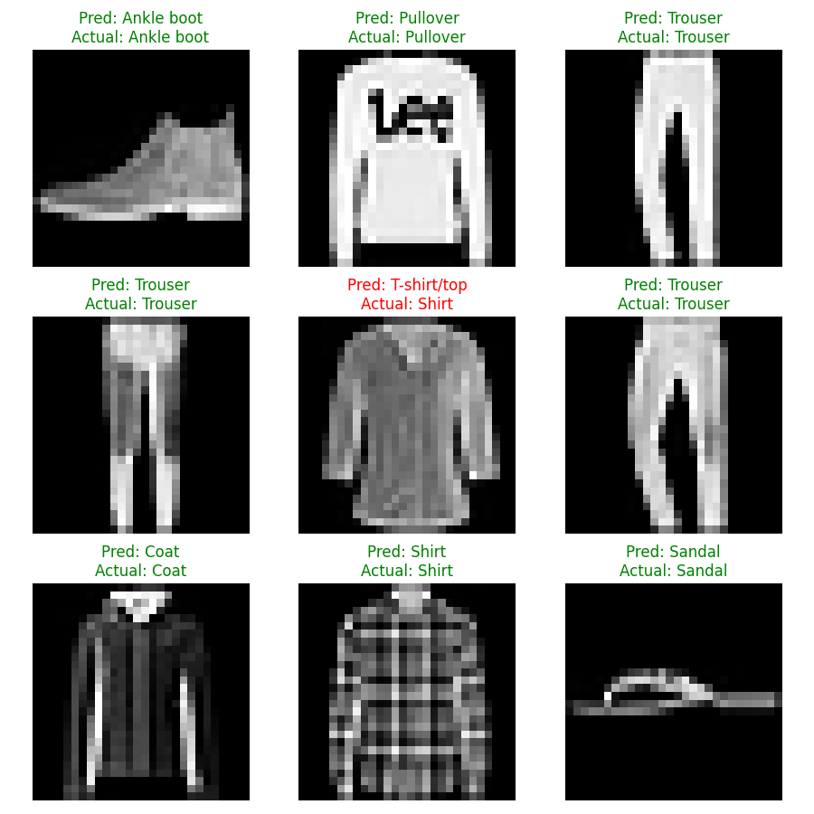

# PyTorch FashionMNIST Classifier

A neural network that classifies clothing images into 10 categories, done to quickly refresh/learn PyTorch fundamentals (https://docs.pytorch.org/tutorials/beginner/basics/quickstart_tutorial.html)

## Results

- **Final accuracy:** 88.6% after 10 epochs
- **Training time:** ~45 minute on Apple M-series GPU (MPS)



## Model Architecture

```
Input (28×28 image)
    ↓ Flatten
784 → Linear → ReLU
512 → Linear → ReLU
512 → Linear
    ↓
10 class scores
```

## What I Learned

- PyTorch tensors and data loading with `DataLoader`
- Building neural networks with `nn.Module`
- Training loop: forward pass → loss → backpropagation → weight update
- GPU acceleration with Apple MPS
- Model saving and inference

## Usage

```bash
# Setup
python -m venv venv
source venv/bin/activate
pip install torch torchvision matplotlib

# Train
python pytorch_quickstart.py
```

## Dataset

[FashionMNIST](https://github.com/zalandoresearch/fashion-mnist) — 70,000 grayscale images of clothing in 10 categories.

```

**3. Add a .gitignore**

Create a `.gitignore` file:
```

venv/
data/
**pycache**/
.DS_Store
